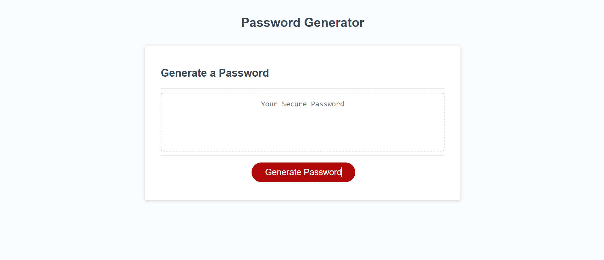

<<<<<<< HEAD
# Password Generator

## Description

This application allows the user to generate a password based on the parameters set by the user.

## Table of Contents

- [Installation](#Installation)
- [Usage](#Usage)
- [License](#License)
- [Questions](#Questions)

## Installation

View the live version here:https://codeb-a.github.io/Password-Generator/

## Usage

Click the "Generate Password" button then follow the on-screen prompts.

## License

MIT

## Questions

For additional information please contact me via GitHub at [https://github.com/codeb-a](https://github.com/codeb-a) or via email at [brandonakers729@gmail.com](mailto:brandonakers729@gmail.com?subject=[GitHub]%README%Generator).
=======
# homework3
Homework Three
>>>>>>> 1cecb72fed797d1d1ffe03c1599d9938bcb2af01
